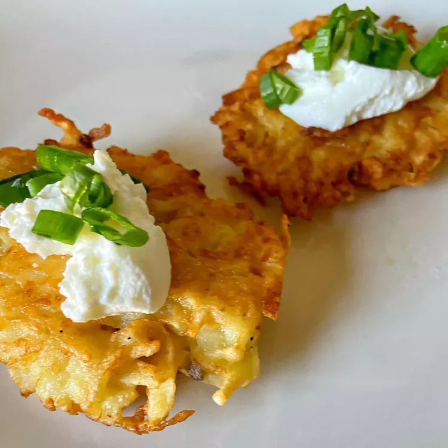

### This is a LOCAL change :)
# Potato Latkes Recipe
line 2 changed remotely
A latke is a type of potato pancake or fritter found in Ashkenazi Jewish cuisine. The dish, which is traditionally served during Hanukkah, can be made with grated, shredded, or mashed potatoes. This top-rated recipe is made with shredded russet potatoes, all-purpose flour, an egg, an onion, and salt. The potato latkes are fried in peanut oil.

*source: https://www.allrecipes.com/recipe/16073/potato-latkes-i/*
last line changed locally
### This is a REMOTE change :O

# Assignment 5 Changes

### From question 1
- this is
- an unordered
- list

Or we can:
1. create
2. nicely ordered
3. lists 
4. if we prefer

It's often important to be able to **emphasize** certain text. *Note: using italics is another way to emphasize text* Even better, you can use ***both at the same time***.

When working with Markdown, you can easily include links to external content, like pictures, just like in HTML:

